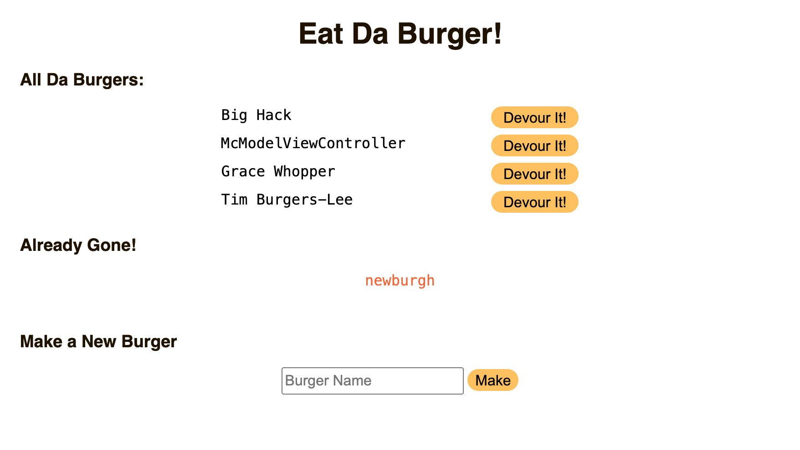

# Eat-Da-Burger

[Heroku Deployed Application](https://blooming-sierra-10900.herokuapp.com/)

## Description

A MVC type app that uses self-written ORM to store and update a database... that's full of burgers. Makes use of express, handlebars and mysql.

## Installation

Clone this repo to your machine and open a terminal at its directory. To install the required dependencies, run `npm install`. Use an SQL client like MySQL Workbench to run the commands found in the db/schema.sql and then the db/seeds.sql files. Alternatively, you can run the `mysql source` command for both of those files through your terminal.

Configure the config/connection.js file to suit the connection properties of your own SQL server.

Run `node server` to start the server and then visit localhost:8080 in your browser.

## Usage

Visit the [deployed application](https://blooming-sierra-10900.herokuapp.com/). You can test the functionality here by adding or devouring burgers.

## License

### MIT License
        
        Copyright 2020 Matt Torcellini

Permission is hereby granted, free of charge, to any person obtaining a copy of this software and associated documentation files (the "Software"), to deal in the Software without restriction, including without limitation the rights to use, copy, modify, merge, publish, distribute, sublicense, and/or sell copies of the Software, and to permit persons to whom the Software is furnished to do so, subject to the following conditions:

The above copyright notice and this permission notice shall be included in all copies or substantial portions of the Software.

THE SOFTWARE IS PROVIDED "AS IS", WITHOUT WARRANTY OF ANY KIND, EXPRESS OR IMPLIED, INCLUDING BUT NOT LIMITED TO THE WARRANTIES OF MERCHANTABILITY, FITNESS FOR A PARTICULAR PURPOSE AND NONINFRINGEMENT. IN NO EVENT SHALL THE AUTHORS OR COPYRIGHT HOLDERS BE LIABLE FOR ANY CLAIM, DAMAGES OR OTHER LIABILITY, WHETHER IN AN ACTION OF CONTRACT, TORT OR OTHERWISE, ARISING FROM, OUT OF OR IN CONNECTION WITH THE SOFTWARE OR THE USE OR OTHER DEALINGS IN THE SOFTWARE.

